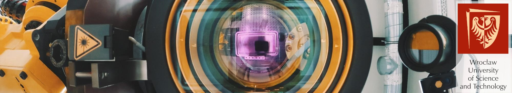

# Machine Vision Laboratory

*Applying innovate vision and laser technologies to industry*

---

We are an interdisciplinary team, who introduces computer vision and laser technologies to industry. We focus on new ways of observation and creation of the world with advanced cameras, innovatory algorithms, optical measurement and laser processing. 

We are open to new challenges in various areas of industry and science

    

        <a href="https://www.linkedin.com/company/68749470/">

</a>
        <a href="https://www.youtube.com/channel/UCyeLfi7MUmoUAJlK1sNjkgQ">

</a>
        <a href="https://github.com/orgs/mvlab-git/repositories">

</a>
    

